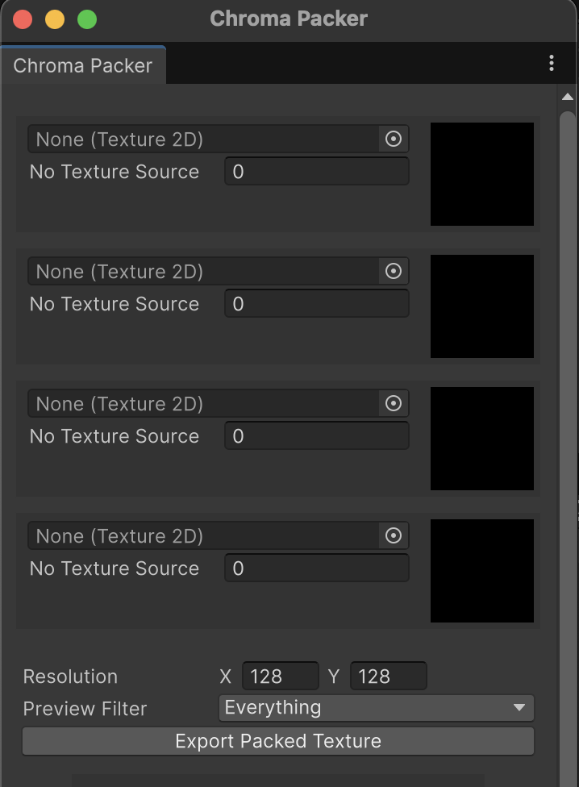
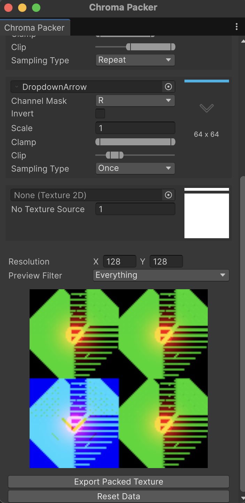

# Chroma Packer
A Unity Editor tool for combining multiple source textures into a single packed texture, with per-channel assignment (R, G, B, A). Great for optimizing texture usage in shaders (e.g. metallic/smoothness/ambient occlusion maps).

### Features
- Assign input textures to specific output channels (R, G, B, A)
- Optional channel input adjustments: inversion, scaling, and clamping
- Supports repeat texture sampling mode
- Real-time preview of the packed texture with configurable filtering options
- Export your packed texture in PNG format

|       Preview 0        |       Preview 1        |
|:----------------------:|:----------------------:|
|  |  |

